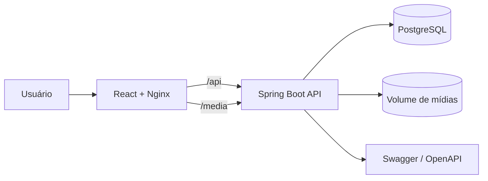

# Cineflix


Plataforma full stack de streaming para cadastro, organização e reprodução de filmes e séries. O projeto combina uma interface responsiva em React com uma API REST em Spring Boot, autenticação JWT, PostgreSQL, migrations com Flyway e armazenamento persistente de arquivos.

> Projeto demonstrativo e educacional. Utilize somente mídias próprias ou para as quais você tenha autorização de uso.

## Funcionalidades

- Catálogo responsivo com carrosséis de filmes e séries.
- Busca por títulos e lista pessoal salva no navegador.
- Cadastro e login usando username, e-mail e senha.
- Autenticação baseada em JWT.
- Cadastro de categorias.
- Relacionamento de categorias com filmes e séries.
- Upload de filme, vídeo e imagem de capa.
- Upload de série, imagem de capa e múltiplos episódios.
- Reprodução de filmes e episódios diretamente na interface.
- Persistência do catálogo no PostgreSQL.
- Persistência das mídias em volume Docker.
- Versionamento do banco de dados com Flyway.
- Documentação interativa da API com Swagger/OpenAPI.
- Layout adaptado para desktop e dispositivos móveis.

## Tecnologias

| Camada | Tecnologias |
| --- | --- |
| Frontend | React 19, Vite 8, JavaScript e CSS |
| Servidor web | Nginx 1.27 |
| Backend | Java 21, Spring Boot 4, Spring Web, Spring Data JPA e Spring Security |
| Autenticação | JWT e OAuth2 Client |
| Banco de dados | PostgreSQL 15 e H2 para testes |
| Migrations | Flyway |
| Infraestrutura | Docker e Docker Compose |
| Documentação | Springdoc OpenAPI e Swagger UI |

## Arquitetura



O Nginx entrega a aplicação React e encaminha as rotas `/api` e `/media` para o backend. Os metadados são armazenados no PostgreSQL, enquanto capas, filmes e episódios permanecem no volume `media_data`.

## Modelo principal

- Um filme pode pertencer a várias categorias.
- Uma série pode pertencer a várias categorias.
- Uma categoria pode estar relacionada a vários filmes e séries.
- Uma série possui vários episódios ordenados pelo número do episódio.
- Cada episódio possui título, número e caminho do arquivo de vídeo.

## Executando com Docker

### Requisitos

- Git
- Docker
- Docker Compose v2

### Instalação

```bash
git clone https://github.com/lucas-mcarvalho/Streaming_Platform.git
cd Streaming_Platform
docker compose up --build -d
```

Depois que os contêineres iniciarem, acesse:

| Serviço | Endereço |
| --- | --- |
| Cineflix | [http://localhost:3000](http://localhost:3000) |
| Backend | [http://localhost:8080](http://localhost:8080) |
| Swagger UI | [http://localhost:8080/swagger-ui.html](http://localhost:8080/swagger-ui.html) |
| OpenAPI JSON | [http://localhost:8080/api-docs](http://localhost:8080/api-docs) |
| PgAdmin | [http://localhost:5050](http://localhost:5050) |
| PostgreSQL | `localhost:5433` |

Para acompanhar os logs:

```bash
docker compose logs -f
```

Para parar os serviços sem apagar os dados:

```bash
docker compose down
```

> `docker compose down -v` também remove os volumes `postgres_data` e `media_data`. Isso apaga usuários, catálogo e arquivos enviados.

## Credenciais do ambiente Docker

As credenciais abaixo são destinadas somente ao desenvolvimento local:

| Serviço | Usuário | Senha |
| --- | --- | --- |
| PostgreSQL | `postgres` | `123` |
| PgAdmin | `admin@email.com` | `123` |

No PgAdmin, cadastre um servidor usando:

- Host: `postgres`
- Porta: `5432`
- Banco: `timerbook`
- Usuário: `postgres`
- Senha: `123`

## Como usar

### Criar uma conta

Abra `http://localhost:3000`, clique no botão de perfil e selecione **Cadastre-se**. O cadastro utiliza username, e-mail e senha.

### Adicionar um filme

1. Entre na sua conta.
2. Clique em **Adicionar título**.
3. Selecione a aba **Filme**.
4. Informe o título.
5. Escolha o vídeo e a imagem de capa.
6. Selecione as categorias disponíveis e envie.

### Adicionar uma série

1. Entre na sua conta.
2. Clique em **Adicionar título**.
3. Selecione a aba **Série**.
4. Informe título, descrição e ano de lançamento.
5. Escolha a imagem de capa.
6. Selecione todos os vídeos dos episódios na ordem correta.
7. Selecione as categorias e conclua o cadastro.

A ordem dos arquivos selecionados define `Episódio 1`, `Episódio 2` e assim por diante. O nome do arquivo, sem a extensão, é usado como título do episódio.

O limite configurado é de **25 GB por requisição**, considerando a soma da capa e dos vídeos enviados.

## Principais endpoints

| Método | Endpoint | Descrição | Formato |
| --- | --- | --- | --- |
| `POST` | `/auth/register` | Cadastra um usuário | JSON |
| `POST` | `/auth/login` | Autentica e retorna os tokens | JSON |
| `GET` | `/categories` | Lista categorias | JSON |
| `POST` | `/categories` | Cria uma categoria | JSON |
| `GET` | `/movies` | Lista filmes | JSON |
| `POST` | `/movies` | Envia filme e capa | Multipart |
| `GET` | `/series` | Lista séries e episódios | JSON |
| `GET` | `/series/{id}` | Busca uma série | JSON |
| `POST` | `/series` | Envia série, capa e episódios | Multipart |
| `GET` | `/media/**` | Entrega capas e vídeos | Arquivo |

### Cadastro de usuário

```bash
curl -X POST http://localhost:8080/auth/register \
  -H "Content-Type: application/json" \
  -d '{
    "username": "lucas",
    "email": "lucas@email.com",
    "password": "senha123"
  }'
```

### Login

```bash
curl -X POST http://localhost:8080/auth/login \
  -H "Content-Type: application/json" \
  -d '{
    "username": "lucas",
    "email": "lucas@email.com",
    "password": "senha123"
  }'
```

### Criar uma categoria

```bash
curl -X POST http://localhost:8080/categories \
  -H "Content-Type: application/json" \
  -d '{"name": "Ficção científica"}'
```

### Upload de filme

```bash
curl -X POST http://localhost:8080/movies \
  -F "title=Interestelar" \
  -F "movie=@./interestelar.mp4" \
  -F "cover=@./interestelar.jpg" \
  -F "categoryIds=1"
```

Para relacionar mais de uma categoria, repita o campo `categoryIds`.

### Upload de série e episódios

```bash
curl -X POST http://localhost:8080/series \
  -F "title=Dark" \
  -F "description=Quatro famílias investigam desaparecimentos em uma pequena cidade." \
  -F "releaseYear=2017" \
  -F "cover=@./dark.jpg" \
  -F "episodes=@./S01E01.mp4" \
  -F "episodes=@./S01E02.mp4" \
  -F "categoryIds=1"
```

## Desenvolvimento local

### Backend

Requer Java 21. O perfil padrão utiliza o H2 em memória, sendo adequado para desenvolvimento rápido e testes locais.

```bash
cd Backend
./mvnw spring-boot:run
```

Para executar os testes:

```bash
cd Backend
./mvnw test
```

### Frontend

Requer Node.js 20 ou superior.

```bash
cd Frontend
npm ci
npm run dev
```

O Vite inicia em `http://localhost:5173` e encaminha `/api` e `/media` para `http://localhost:8080`.

Para gerar a versão de produção:

```bash
cd Frontend
npm run build
```

## Variáveis de ambiente

| Variável | Uso | Padrão |
| --- | --- | --- |
| `SPRING_PROFILES_ACTIVE` | Perfil do Spring | `test` no projeto e `dev` no Docker |
| `STORAGE_LOCATION` | Diretório de capas e vídeos | `./storage` ou `/app/storage` no Docker |
| `VITE_API_URL` | URL base da API no frontend local | `/api` |
| `GOOGLE_CLIENT_ID` | Client ID do OAuth2 Google | Sem valor padrão |
| `GOOGLE_CLIENT_SECRET` | Client secret do OAuth2 Google | Sem valor padrão |
| `MAIL_HOST` | Servidor SMTP | `smtp.gmail.com` |
| `MAIL_PORT` | Porta SMTP | `587` |
| `MAIL_USERNAME` | Usuário SMTP | Vazio |
| `MAIL_PASSWORD` | Senha SMTP | Vazio |

Exemplo usando outra URL de API no frontend:

```bash
VITE_API_URL=https://api.exemplo.com npm run dev
```

## Estrutura do projeto

```text
Streaming_Platform/
├── Backend/
│   ├── src/main/java/com/user/streaming/
│   │   ├── config/          # Segurança, CORS e arquivos estáticos
│   │   ├── controllers/     # Endpoints REST
│   │   ├── dto/             # Objetos de entrada e saída
│   │   ├── models/          # Entidades JPA
│   │   ├── repository/      # Repositórios Spring Data
│   │   └── service/         # Regras de negócio
│   ├── src/main/resources/
│   │   └── db/migration/    # Migrations Flyway
│   ├── Dockerfile
│   └── pom.xml
├── Frontend/
│   ├── src/                 # Componentes, estilos, API e catálogo
│   ├── Dockerfile
│   ├── nginx.conf
│   └── package.json
├── docker-compose.yml
└── README.md
```

## Persistência de dados

O Docker Compose cria dois volumes:

- `postgres_data`: usuários, categorias, filmes, séries e episódios.
- `media_data`: capas, vídeos de filmes e arquivos dos episódios.

Os dados continuam disponíveis após reiniciar ou recriar os contêineres. Eles só são removidos quando os volumes são apagados explicitamente.

## Segurança antes de publicar em produção

Antes de disponibilizar o projeto em um servidor público:

- Troque as senhas padrão do PostgreSQL e PgAdmin.
- Mova o segredo JWT e as credenciais do banco para variáveis de ambiente.
- Configure HTTPS.
- Restrinja as rotas de upload para usuários autorizados.
- Desative ou proteja Swagger e PgAdmin.
- Considere armazenar mídias em um serviço de objetos, como S3 ou equivalente.

## Autor

Desenvolvido por [Lucas Carvalho](https://github.com/lucas-mcarvalho).
